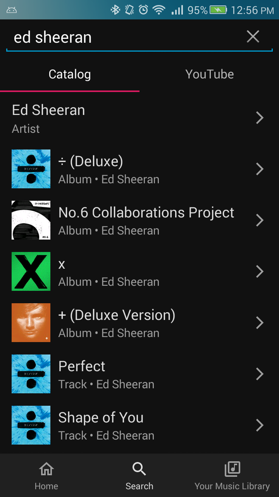
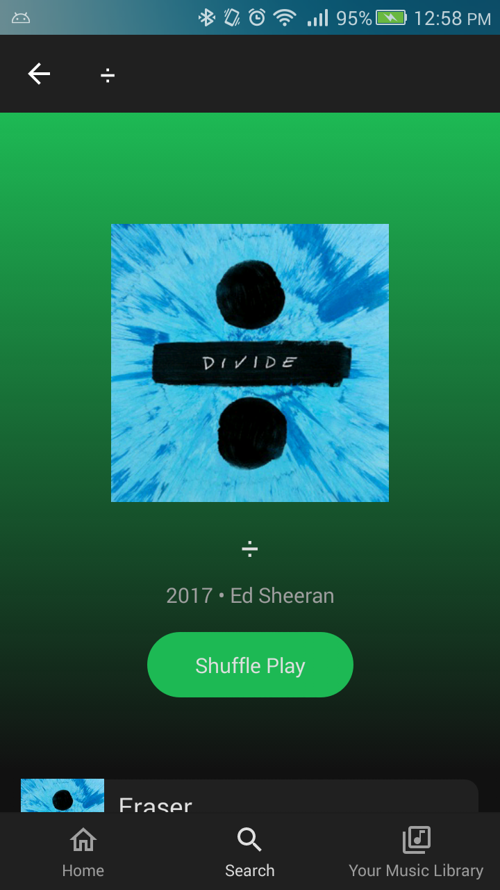
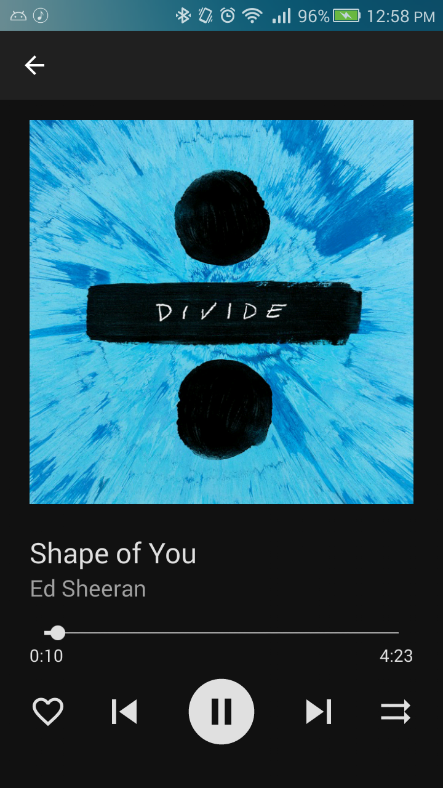

<a href="https://github.com/williamrob104/Musichub" target="_blank">

</a>

Musichub is a music streaming app on android. It allows users to browse music either from a music catalog or from YouTube, and stream music/video through the internet or download for offline playback.

## Screenshots

 
 

## Developer Instructions
1. Fork this repository and clone it.
2. Clone the [ExoPlayer](https://github.com/google/ExoPlayer) repository and put it in the same directory.  
/some/directory  
├── Musichub  
└── ExoPlayer
3. Follow instructions to add support for [VP9](https://github.com/google/ExoPlayer/tree/release-v2/extensions/vp9) and [Opus](https://github.com/google/ExoPlayer/tree/release-v2/extensions/opus) on pre-android [4.4](https://developer.android.com/guide/topics/media/media-formats#video-codecs)/[5.0](https://developer.android.com/guide/topics/media/media-formats#audio-codecs) devices.